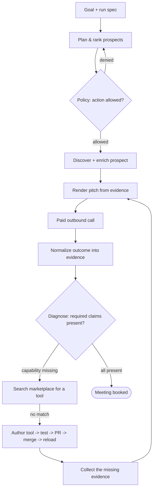

# PitchLoop

**An autonomous sales & marketing outreach agent that grows its own toolset.**

Give PitchLoop a goal in plain language — *"find local businesses that need a better website and book one qualified consultation"* — and it runs the entire outreach loop on its own: it discovers and researches prospects, calls them, learns from every conversation, and when it hits a capability it doesn't have, it **builds, verifies, ships, and reuses a new tool** to close the gap. Every action is gated by a real access-control policy and recorded as verifiable evidence.

> Built for the Loop Engineering Hackathon on three sponsor platforms: **Zero.xyz**, **Pomerium**, and **Nexla**.

---

## The problem

Marketing and sales outreach is one of the most painful, manual, and repetitive parts of running a company — finding the right people, reaching them, following up, and figuring out what messaging actually lands. Most "AI SDR" tools automate a *fixed* script. PitchLoop is different: it's a self-improving agent that treats a failed call as a signal, diagnoses what it was missing, and **extends its own capabilities** rather than waiting for an engineer to hand-code the next feature.

---

## What it does

1. **Understands a goal.** You describe the outcome you want in natural language.
2. **Plans autonomously.** It builds and ranks a prospect queue — no step-by-step human direction.
3. **Checks policy first.** Before any sensitive action it asks the access layer whether it's allowed.
4. **Discovers & enriches.** It buys prospect-discovery, professional enrichment, and contact-resolution services at runtime.
5. **Calls.** It places a real, paid outbound call with a pitch personalized from verified evidence.
6. **Learns.** It parses the outcome, records what worked and what failed, and revises its sales strategy for the next prospect.
7. **Grows its toolset.** If it lacks a capability (e.g., a website audit), it searches the marketplace; if nothing exists, it **writes a constrained tool, tests it, opens a pull request, merges it, and reloads it at runtime.**
8. **Retries — and improves.** It reuses the new capability on later prospects and keeps going until it books a qualified meeting.

Every run produces a complete, auditable trail: policy decisions, paid receipts, transcripts, diagnoses, generated-tool history, and the final booked meeting.

---

## How it works



The agent is a single **explicit state machine** — not an open-ended agent framework. Every transition is justified by a returned model or normalized evidence (e.g., *"the policy denied this prospect,"* *"the call is missing claim X,"* *"the marketplace returned no match"*), never by hardcoded or demo-only shortcuts.

---

## The three pillars

### Zero.xyz — runtime capability marketplace
The agent isn't limited to the services it shipped with. At runtime it **searches for and purchases** the capabilities it needs — prospect discovery, professional enrichment, contact resolution, and the outbound calls themselves — enforces a hard budget from real receipts, and treats the marketplace as the backbone of its self-improvement loop. When a capability doesn't exist for sale, that gap triggers tool authoring.

### Pomerium — policy & access-control layer
Every sensitive action is authorized **before** it happens: contacting a prospect, accessing a data source, executing a newly generated tool, and making protected repository changes. Denials are recorded and reroute the agent to the next qualified prospect. Generated tools are confined to only the data sources and repository operations they legitimately need, and the software-change workflow (branch → commit → pull request → merge) is gated so unverified code and fixed tests can't be tampered with.

### Nexla — evidence & lineage layer
Every event the agent emits is normalized into one consistent, trustworthy record and streamed back to the agent as a single source of truth. The agent's diagnosis and next pitch read **only** this normalized evidence — never raw provider output — so decisions are reproducible and every claim is traceable end-to-end, with secrets redacted before anything is persisted.

---

## Architecture

PitchLoop is a hexagonal (ports-and-adapters) system. A frozen set of typed **contracts** defines the data models and the port interfaces; the agent core depends only on those ports, and each external system is a swappable adapter.

```text
pitchloop/
  contracts/          # Frozen Pydantic models + port Protocols (shared source of truth)
  agent/              # Autonomous core
    orchestrator.py   #   the explicit state machine
    planner.py        #   deterministic planning + prospect ranking
    diagnosis.py      #   decides the next move from normalized evidence
    tool_registry.py  #   loads generated tools by capability at runtime
    tool_author.py    #   generates + repairs constrained tools
    artifacts.py      #   atomic, redacted run-artifact writer
  integrations/       # Adapters implementing the ports
    zero_client.py    #   Zero.xyz marketplace
    policy_client.py  #   Pomerium authorization
    repo_client.py    #   Git/GitHub change workflow
    call_client.py    #   outbound calling
    evidence_client.py#   Nexla normalization + sink
  scenario/           # Campaign spec, persona, fact contract
  pitch/              # Pitch rendering + transcript parsing
  callee/             # Deterministic call rubric + harness
  fixtures/           # Local signal servers for development
  conformance/        # Fixed test suite generated tools must pass
  infra/              # Pomerium data-plane (Docker Compose) + policy target
  evidence/           # Nexla sink, store, redaction, schemas
  demo/               # CLI demo runner + read-only proof dashboard
  generated_tools/    # Tools the agent authors at runtime
  tests/              # Unit + end-to-end tests
```

### Design principles
- **Observation-driven control flow.** State transitions come from models/evidence, not flags.
- **Everything leaves a receipt.** Each action writes structured JSON artifacts, even on failure.
- **Injectable interfaces.** Every adapter can run in a `fake` in-process mode for fast, deterministic development, then swap to `live` behind configuration.
- **Fail loud, not silent.** Errors become explicit failed observations, never swallowed exceptions.

---

## Tech stack

| Layer | Technology |
|---|---|
| Language | **Python 3.12** |
| Models & contracts | **Pydantic v2** |
| HTTP | **httpx** |
| Local services & dashboard | **FastAPI + Uvicorn**, **Jinja2** |
| Config & templates | **PyYAML**, Jinja2 |
| Terminal output | **Rich** |
| Tests | **pytest** |
| Capability marketplace | **Zero.xyz** (CLI + wallet) |
| Access control | **Pomerium** (Docker Compose data plane / Pomerium Zero) |
| Evidence & lineage | **Nexla** (data flow + `nexla-sdk`), exposed via **ngrok** |
| Source control workflow | **Git + GitHub** (`gh` CLI) |
| Tool code-generation | **AWS Bedrock** (or a configurable model endpoint) behind a narrow adapter |
| Web dashboard | **HTML / CSS / JavaScript** |

---

## Getting started

```bash
# 1. Set up a virtual environment and install dependencies
make setup

# 2. Run the full loop end-to-end (in-process mode, no external services)
make run-fake

# 3. Run the test suite
make test

# 4. Launch the read-only proof dashboard
python -m demo.ui        # http://127.0.0.1:8000
```

Run the agent against a scenario directly:

```bash
python -m agent --spec scenario/run_spec.json
```

Each adapter is selected independently by environment variable, so you can bring the system live one integration at a time.

### Configuration

| Group | Variables |
|---|---|
| Run | `PITCHLOOP_RUN_ID`, `PITCHLOOP_RUN_DIR` |
| Modes | `ZERO_MODE`, `POLICY_MODE`, `CALL_MODE`, `REPO_MODE`, `EVIDENCE_MODE`, `AUTHOR_MODE` |
| Zero | `ZERO_CLI`, `ZERO_CALL_SERVICE_ID`, `ZERO_FACT_A_CAPABILITY`, `ZERO_FACT_B_CAPABILITY` |
| Pomerium | `POMERIUM_ALLOWED_URL`, `POMERIUM_DENIED_URL`, `POMERIUM_SERVICE_ACCOUNT_TOKEN` |
| Nexla | `NEXLA_SERVICE_KEY`, `NEXLA_INGRESS_URL`, `NEXLA_FLOW_ID`, `NEXLA_SINK_URL` |
| Repo & codegen | `GITHUB_REPO`, `GH_TOKEN`, `CODE_AGENT_COMMAND`, `AWS_REGION`, `BEDROCK_MODEL_ID` |
| Calling | `CALLEE_PHONE_E164` |

Secrets, phone numbers, and unredacted receipts are never committed.

---

## Safety & guardrails

Autonomy is only useful if it's safe. PitchLoop constrains itself at every step:

- **Policy on every sensitive action** — nothing happens without an allow decision.
- **Budget enforcement** — a paid action only fires while `spent + price <= budget`, tracked from real receipts.
- **Path-restricted code generation** — a generated tool may only create its three approved files; any change outside that set is rejected.
- **Verified before merge** — generated code must pass a fixed conformance suite (with a single automated repair attempt) and is only loaded after its pull request merges.
- **Least privilege** — generated tools receive access only to the sources and operations they need.
- **Full auditability** — every run is reconstructable from its persisted evidence.

---

## Responsible use

Live calling is deliberately confined to a single configured, consented number, even when the prospect queue shows multiple personas — there is no arbitrary outreach. Phone numbers, credentials, and unredacted receipts are excluded from version control.

---

## Roadmap

- Broaden prospect discovery beyond seeded scenarios to open marketplace sourcing.
- Add a dedicated contact-resolution capability.
- Let the agent purchase a matching marketplace tool instead of always authoring one.
- Evolve strategy beyond tactics toward richer campaign planning.
- Multi-campaign learning shared across runs.
