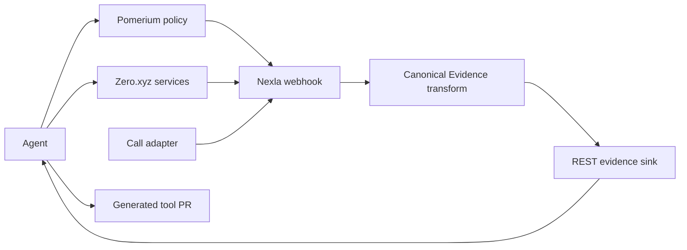

# PitchLoop

PitchLoop is a consent-gated sales campaign agent that learns across people and acquires or authors missing evidence tools.

## Problem and insight

Most self-improving agents rewrite prompts. PitchLoop records an evidence-backed reflection after every call, updates the campaign strategy for the next person, and grows its toolset when a missing capability blocks progress.

## Deterministic scenario

PitchLoop sells the fictional MigrationGuard product to fictional Northstar Systems. `alex_rivera` is denied by policy and is never called. Each eligible contact is called at most once. Maya exposes a missing deadline signal; later contacts surface value, proof, friction, and timing objections; the accumulated strategy eventually books Theo.

## Autonomous loop

Goal → plan → candidate policy/enrichment → one call → normalized diagnosis → reflection receipt → strategy/tool improvement → next uncalled candidate → qualified meeting.

## Architecture



## Why the integrations are causal

- Zero.xyz supplies the paid enrichment and call outcomes; the agent searches its live catalog before authoring a missing tool.
- Pomerium produces a real denial for the non-consenting contact and an allow for the consenting contact. The denial is never bypassed.
- Nexla is the live normalization and read path used for diagnosis; live mode cannot normalize locally or read raw files.

## Run locally

Requires Python 3.12.

```bash
python3.12 -m venv .venv
.venv/bin/pip install -e '.[dev]'
.venv/bin/pytest -q
cp .env.example .env
demo/run_demo.sh
```

## Visual demo

```bash
.venv/bin/python -m demo.ui
```

Open `http://127.0.0.1:8000`, enter a natural-language campaign objective, and
launch the fake/local campaign. The desktop dashboard refreshes while the agent
works and exposes campaign statistics, every candidate and call, reflections,
strategy changes, generated tools, evidence, receipts, transcripts, and the
append-only agent action history. Click a completed call to inspect its full
record; use the campaign picker to revisit prior runs.

## Live configuration

Set the environment variables listed in `.env.example`. For Nexla, expose the local sink with ngrok, configure one webhook → transform → REST destination flow, then set `NEXLA_SERVICE_KEY`, `NEXLA_INGRESS_URL`, `NEXLA_FLOW_ID`, and the public `NEXLA_SINK_URL`. Never commit their values.

## Proof artifacts

The integrated fake demo writes each run under `runs/fake-demo.*` or `runs/campaign-*` and reaches `MEETING_BOOKED`. Nexla lineage, paid receipts, Pomerium responses, calls, and the generated-tool PR remain live-run artifacts and must not be represented as complete until captured.

## Generated-tool PR

Pending the live autonomous run. The generated tool is restricted to `fact_b` and must pass the fixed conformance suite before merge.

## Limitations and ethics

This hackathon build supports one fictional company, a deterministic desktop campaign, and one generated capability. Live calling remains deliberately limited to one configured callee; the larger cohort is fake/local. It has no arbitrary outreach, calendar integration, or policy bypass. Phone numbers, credentials, and unredacted receipts are excluded from Git.

## Team

- P1: contracts, agent loop, and Zero adapter
- P2: scenario, pitch, call adapter, fixture, and conformance
- P3: Pomerium and GitHub adapters
- P4: Nexla evidence path, integration, and release

## Hackathon requirement matrix

| Requirement | Proof |
|---|---|
| Read specification and plan | `runs/demo-001/spec.json`, `plan.json` |
| Real policy denial and allow | `policy/deny.json`, `policy/allow.json` |
| Runtime discovery and paid action | `zero/search_fact_a.json`, receipts |
| Diagnose missing capability | Nexla-normalized evidence and `evidence/diagnosis.json` |
| Author, test, and merge tool | conformance result and generated-tool PR |
| Reload and improve later calls | Tool reuse, strategy versions, reflection receipts, and the booked meeting artifact |
